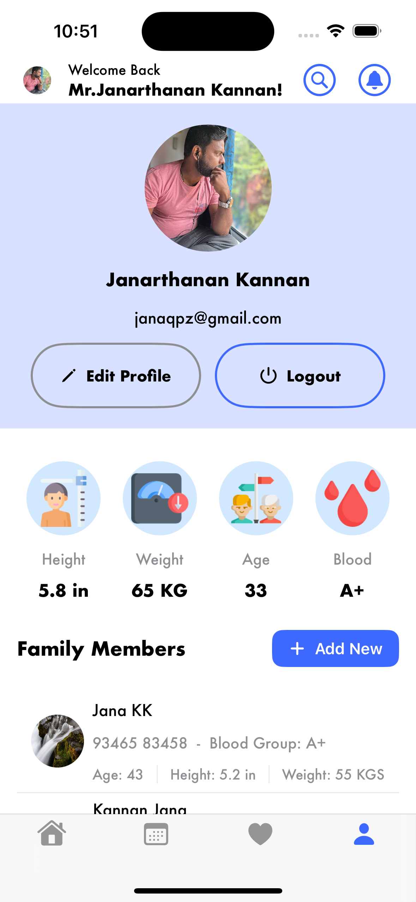

<h3>Clinic Booking - SwiftUI</h3>

ClinicBooking App - SwiftUI is a simple Clinic app with list of doctors and booking your appointments, Add your personal details like height, weight, age and blood here for your personal and family members.
   
<h3>Tech Used</h3>

<ul>
  <li>Designed with MVVM architecture</li>
  <li>Swift 5</li>
  <li>SwiftUI</li>
  <li>Firebase Database</li>
  <li>Firebase Authentication</li>
  <li>Firebase Storage</li>
  <li>XCode 15</li>
</ul>
  

<h3>Screens</h3>

  
  
  
  
  
  
  
  

